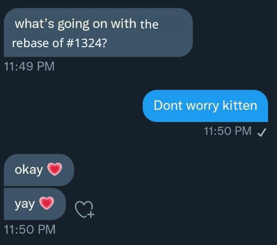

Some core concepts
---

# Changes
Changes are git commits that can evolve over time.

Jj keeps (and displays) change ids and commit ids (when the git id is used).
Those are different as git ids usually change, whereas change ids do not

# Bookmarks
Think of bookmarks as literal bookmarks. They follow a change and do not change
if subsequent changes are made.

They are very similar to git lightweight tags

# Revsets
Revsets are the jj way of representing a set of changes (set of revisions ->
revset)

These sets are represented through a functional language, even though the
majority of commands accept revsets that resolve to single changes

Some revsets are more equal than others, e.g. `trunk()`, `immutable_heads()` 

Some somewhat important concepts
---

# Working copy
The working copy is where the current working-copy commit's files are written so
you can interact with them. It is also where files are read from in order to
create new commits (though there are many other ways of creating new commits).

# First class conflicts
Unlike most other VCSs, Jujutsu can record conflicted states in commits. For
example, if you rebase a commit and it results in a conflict, the conflict will
be recorded in the rebased commit and the rebase operation will succeed. You can
then resolve the conflict whenever you want. Conflicted states can be further
rebased, merged, or backed out.

# Operation log
Jujutsu records each operation that modifies the repo in the "operation log".
You can see the log with jj op log. Each operation object contains a snapshot of
how the repo looked at the end of the operation.

Ok, but why should I care?
---
<!-- column_layout: [1,1] -->

<!-- column: 0 -->

# Rebasing is hard
not really _hard_ hard but _cumbersome_ hard, git takes you trough a long process of choosing which commits to rebase, update refs?, maybe, if you want to edit a commit in the meantime good luck and so on. JJ makes things easier and
smoother


<!-- column: 1 -->

# Editing intermidiate commits is hard

in jj is just

```bash
jj edit [revision]
```

# inserting, splitting, whatever, jj makes it easy
JJ gives you tools and makes based opinions the easy way of using such tools
```bash
jj split # pops up a ui to split changes

jj new # can put commits after or before a particualr revision / sevset
```
<!-- reset_layout -->

Fine, can I touch something?
---


Sure! here's a small demo on astarte
